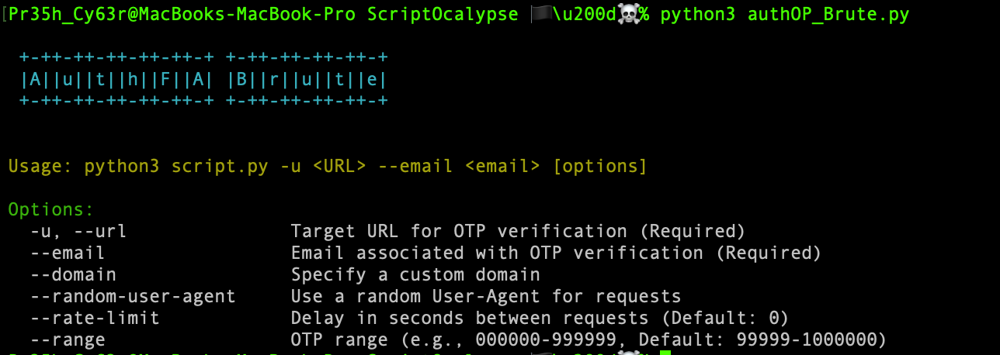

# AuthFA-Brute 🏴‍☠️

⚡ Ever wonder how the absence of rate-limiting on auth/token endpoints can be abused at scale?  
**AuthFA-Brute** is a research-oriented proof-of-concept that demonstrates the risk posed by unprotected authentication and token verification endpoints. In authorized assessments, this kind of approach has highlighted how predictable verification flows combined with high concurrency can lead to account compromise.

> **Important:** This repository documents research and findings only. Do **not** use this code against systems you do not own or have explicit written permission to test.

---

## TL;DR — What this does (high level)
- Models a highly concurrent verification workflow targeting token/OTP endpoints.  
- Leverages asynchronous request patterns and configurable variability to demonstrate how a lack of rate-limiting or anti-automation controls can expose authentication flows to large-scale probing.  
- Illustrates how predictable success/failure responses from token endpoints can be used (in authorized tests) to identify valid authentication attempts.

---

## Purpose & Scope
This project exists to document and demonstrate, at a conceptual level, how weakly protected authentication endpoints (token/OTP flows) can be probed when protections are absent or misconfigured. The focus is on **research, disclosure, and defensive awareness** — showing defenders what to look for, not how to exploit live systems.

---

## High-level Features (non-actionable)
- Asynchronous, concurrent request engine (demonstrative)  
- Configurable request variability to emulate different attacker behaviours (for analysis)  
- Pluggable header and user-agent variability to model traffic patterns (for study)  
- Clear code structure intended for review, analysis, and detection-rule creation

---

## Ethical Notice
This code is provided for security research, authorized penetration testing, and defensive analysis. Any use against targets without explicit written permission is illegal and unethical. By engaging with this repository you agree to adhere to applicable laws and professional ethical standards.

---

## Repo Tagline
**AuthFA-Brute — a research PoC demonstrating how unprotected token/OTP endpoints can be probed at scale (authorized use only).**
